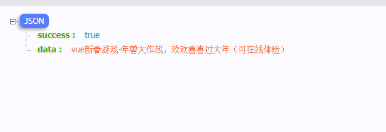
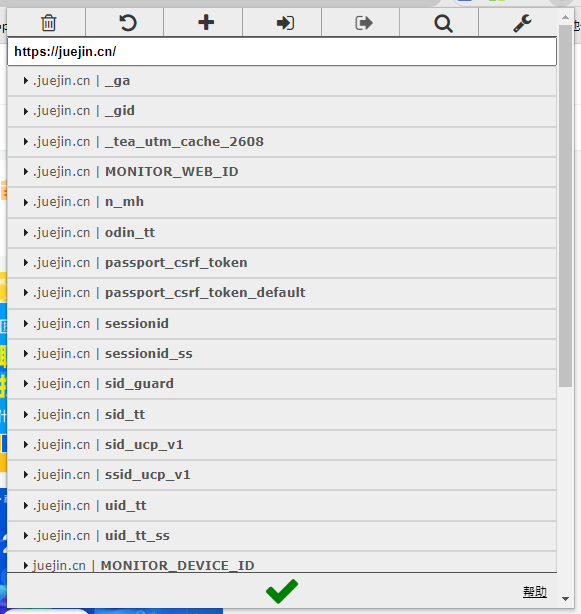
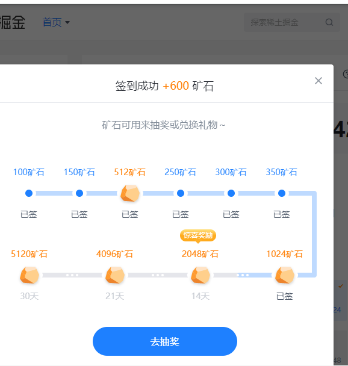

# node 自动爬虫

## 使用技术

- node 中的[nestjs 框架](https://docs.nestjs.cn/8/introduction)
- 爬虫[puppeteerjs](http://www.puppeteerjs.com/)
- node [fs 模块](https://www.runoob.com/nodejs/nodejs-fs.html)
- [pm2](https://pm2.keymetrics.io/)
- 想使用数据库的话[typeorm](https://typeorm.biunav.com/zh/#%E5%AE%89%E8%A3%85)

## 需求

实现掘金自动签到抽奖等等

## 开始

1. 使用 nest cli 创建项目

```
npm i -g @nestjs/cli
nest new demo
cd demo/
npm run start:dev

```

在 main.ts 中增加

```
import { NestFactory } from '@nestjs/core';
import { AppModule } from './app.module';

async function bootstrap() {
  const app = await NestFactory.create(AppModule);
  await app.listen(3000);
  // 新增加的
  console.log(`3000端口启动`);
}
bootstrap();

```

浏览器输入 http://localhost:3000/ 看到 Hello World! 项目创建启动成功。  
接下来，我们开始使用爬虫

## puppeteer 爬虫

```
cnpm  i puppeteer
```

使用爬虫随便获取一下掘金的首页内容  
app.service.ts 代码如下

```
import { Injectable } from '@nestjs/common';
import * as puppeteer from 'puppeteer';

@Injectable()
export class AppService {
  headless = false; // 本地调试使用false 打开浏览器窗口方便调试
  url = 'https://juejin.cn'; // 要登录的url
  getHello() {
    return this.init();
  }

  // 爬虫
  async init() {
    const url = this.url;
    const browser = await puppeteer.launch({
      headless: this.headless,
      args: ['--no-sandbox', '--disable-setuid-sandbox'],
    });
    const page = await browser.newPage();
    await page.goto(url);
    // 等待时间
    await page.waitForTimeout(3000);
    // 监听console.log 否则page.evaluate里面的console看不到
    page.on('console', (msg) => {
      for (let i = 0; i < msg.args().length; ++i)
        console.log(`page: ${msg.args()[i]}`); // 这句话的效果是打印到你的代码的控制台
    });
    const bodyHandle = await page.$('body');
    // 代码运行到浏览器里面。不是后台服务里面
    const dataMsg = await page.evaluate(async (body) => {
      // 我们尝试随便获取一下页面元素
      const text = body.querySelector('.content-wrapper .content-main .title-row a').innerHTML;
      return Promise.resolve(text);
    }, bodyHandle);
    await page.waitForTimeout(5000);
    // 关闭浏览器
    // await page.close();
    return { success: true, data: dataMsg };
  }
}

```

刷新 3000 端口会看到程序打开了一个新的浏览器窗口
  
我们的接口返回内容  


bodyHandle 就是我们获取到的 body 元素，接下来就是按照自己的需要，获取页面上的各种元素。

## 分析登录

我们点击登录后会发现，他有人机识别的校验，这个对于我们来说有点难度。咱们换个思路，既然登录了，肯定会有 cookie，使用谷歌插件 EditThisCookie。自己登录一下掘金然后导出整个 cookie  
  
现在我们的思路就是先导出整个 cookie，然后使用 puppeteerjs 去设置我们浏览器的 cookie，再去点击签到这个按钮。

## 导入 cookie

再 src 下面创建 data.json 格式如下

```
{
  'xxxx':[
    // 导出的cookie内容
  ]
}
```

掘金签到页面  
url='https://juejin.cn/user/center/signin'  
我们来点击签到按钮，先来判断一下是否能拿到，没有获取到我们就认为登录失败。  
代码如下：

```
import { Injectable } from '@nestjs/common';
import * as puppeteer from 'puppeteer';

import * as fs from 'fs';

@Injectable()
export class AppService {
  headless = false; // 本地调试使用false 打开浏览器窗口方便调试
  url = 'https://juejin.cn/user/center/signin'; // 要访问的url
  cookieData = {};
  page;
  constructor() {
    this.init();
  }

  getHello() {
    return { data: '6666666' };
    // return this.signin();
  }

  // 从本地文件获取cookie
  getCookieData() {
    return new Promise(async (resolve, reject) => {
      try {
        const data = await fs.readFileSync('src/data.json').toString();
        this.cookieData = JSON.parse(data);

      } catch (error) {
        reject(error);
      }
      resolve(true);
    });
  }

  // 爬虫
  async signin(cookieList) {
    const url = this.url;
    const browser = await puppeteer.launch({
      headless: this.headless,
      args: ['--no-sandbox', '--disable-setuid-sandbox'],
    });
    this.page = await browser.newPage();
    // 跳转页面前设置cookie
    await this.setCookie(cookieList);

    await this.page.goto(url);
    // 等待时间
    await this.page.waitForTimeout(3000);
    // 监听console.log 否则page.evaluate里面的console看不到
    this.page.on('console', (msg) => {
      for (let i = 0; i < msg.args().length; ++i)
        console.log(`page: ${msg.args()[i]}`); // 这句话的效果是打印到你的代码的控制台
    });
    const bodyHandle = await this.page.$('body');
    // 代码运行到浏览器里面。不是后台服务里面
    const dataMsg = await this.page.evaluate(async (body) => {
      let msg = '';
      let btn: any = body.querySelector('.signin.btn');
      if (btn) {
        btn.click();
        msg = '签到成功';
      } else {
        btn = body.querySelector('.signedin.btn');
        const n = document.querySelector(
          '.figure-card.large-card span',
        ).textContent;
        if (btn) {
          btn.click();
          msg = '已经签到,当前钻石数：' + n;
        } else {
          msg = '签到失败';
        }
      }
      console.log(msg);

      return Promise.resolve(msg);
    }, bodyHandle);
    await this.page.waitForTimeout(5000);
    // 关闭浏览器
    // await this.page.close();
    return { success: true, data: dataMsg };
  }

  // 循环设置cookie，爬虫签到
  async init() {
    await this.getCookieData();
    const arr = Object.keys(this.cookieData);
    for (let i = 0; i < arr.length; i++) {
      const cookieList = this.cookieData[arr[i]];
      this.signin(cookieList)
    }
  }

  async setCookie(cookieList: any[]) {
    return new Promise(async (resolve, reject) => {
      // 处理脏数据
      if (!Array.isArray(cookieList)) {
        reject('set cookie err,cookieList must be array');
      }
      const list = [];
      cookieList.forEach(async (el) => {
        const item = {
          name: el.name,
          value: el.value,
          // url: 'juejin.cn',
          domain: el.domain,
          path: el.path,
          expires: el.expirationDate,
          httpOnly: el.httpOnly,
          secure: el.secure,
          sameSite: el.sameSite,
        };
        list.push(item);
      });
      await this.page.setCookie(...(list as any));
      resolve(true)
    });
  }
}

```

      
好了，现在可以成功签到了。因为我们已经把cookie写入到浏览器里面了。后面就可以随意操作页面了，为了防止被封IP，我们加入了一点等待时间。下面我们使用定时任务来跑。

### 定时任务

使用[node-schedule](https://www.npmjs.com/package/node-schedule)

```
npm i node-schedule
```

代码如下：

```
import * as schedule from 'node-schedule';

// 定时任务
job() {
  // 每天8点半执行签到任务
  schedule.scheduleJob('0 30 8 * * *', async () => {
    console.log('scheduleCronstyle:' + new Date());
    this.init();
  });
}
```

### 更新 cookie

有可能允许一段时间后我们的 cookie 就过期了。我们来写个接口，更新并保存 cookie
app.controller.ts

```
  @Post('add')
  add(@Body() body) {
    console.log(body);
    const { name } = body;
    const cookie = body.cookie;
    return this.appService.addCookie(name, cookie);
  }
```

app.service.ts

```

  // 更新cookie
  async addCookie(name: string, cookie: any[]) {
    const data = await fs.readFileSync('src/data.json').toString();
    this.cookieData = JSON.parse(data);
    this.cookieData[name] = cookie;
    console.log(this.cookieData);
    let msg;
    try {
      msg = await this.signin(cookie);
    } catch (error) {
      return {
        success: false,
        data: `更新${name}的cookie失败,${error}`
      };
    }
    console.log(msg);

    if (msg.success) {
      this.cookieData[name] = cookie;
      await fs.writeFileSync('src/data.json', JSON.stringify(this.cookieData));
      return {
        success: true,
        data: `更新${name}的cookie成功`
      };
    } else {
      return {
        success: false,
        data: `更新${name}的cookie失败`
      };
    }
  }
```

## 部署到服务器

```
yarn
npm run build
pm2 start npm --name autojuejin -- run start
```

这个地方会有个报错，仔细看提示，需要安装一下就可以。相信你会解决的。
